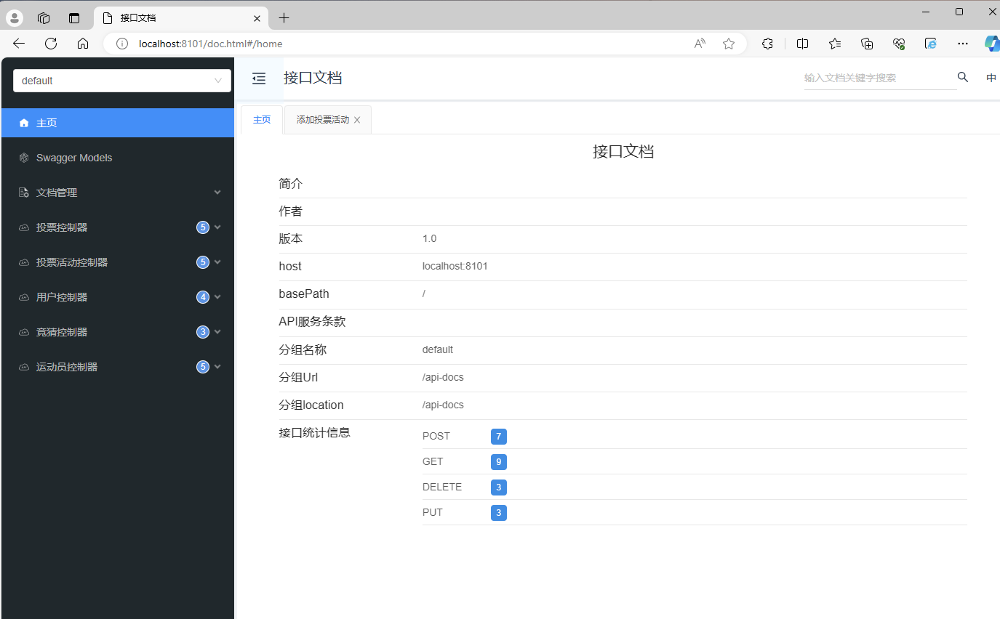

### MySQL 数据库

1）修改 `application.yml` 的数据库配置为你自己的：

```yml
spring:
  datasource:
    driver-class-name: com.mysql.cj.jdbc.Driver
    url: jdbc:mysql://localhost:3306/my_db
    username: root
    password: 123456
```

2）执行 `sql/create_table.sql` 以及 `sql/sample.sql`中的数据库语句，自动创建库表并插入样例数据

3）启动项目，访问 `http://localhost:8101/doc.html` 即可打开接口文档，在线调试接口了

